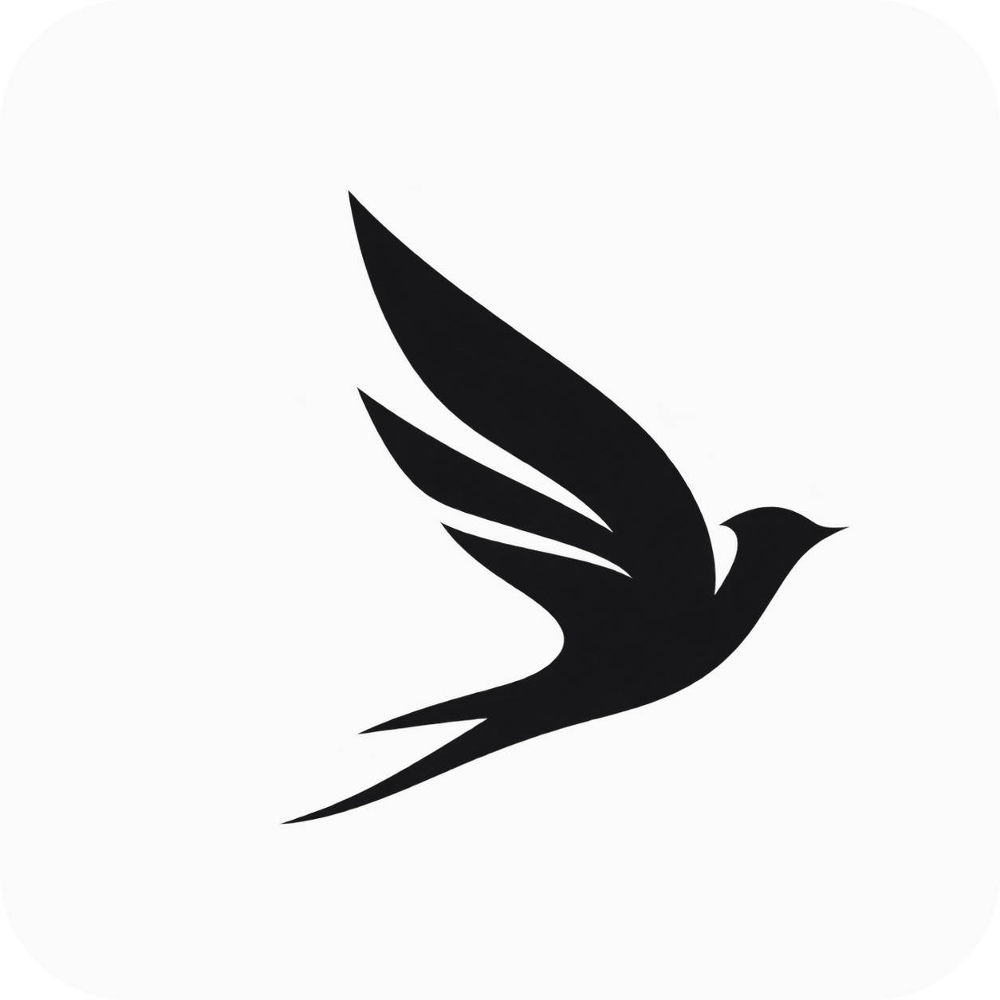
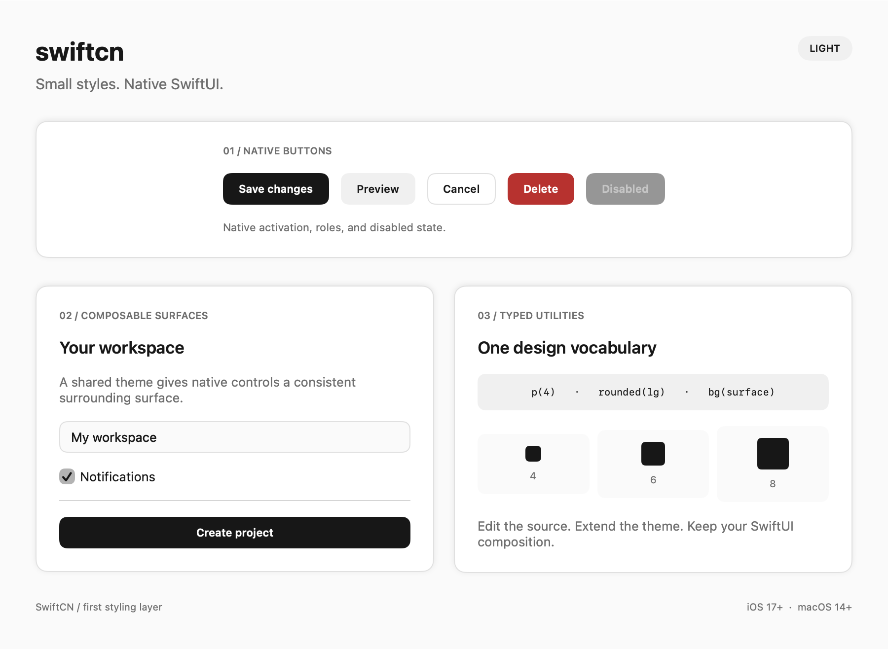

# swiftcn



[Documentation](https://cbethin.github.io/swiftcn/) · [Get started](https://cbethin.github.io/swiftcn/docs/installation/)

String and typed utility styling with editable recipes for native SwiftUI.



```swift
import SwiftUI
import SwiftCN

Text("Workspace")
    .tw("text-lg font-semibold p-4 bg-surface rounded-lg")

Button("Save", action: save)
    .buttonStyle(.tw("button-primary"))
    .keyboardShortcut(.defaultAction)
```

swiftcn starts with a small styling layer for SwiftUI.
Compose string or typed utilities, share theme values, and edit named styles in ordinary Swift.
Keep native controls, layout, state, and interaction in your application.

Requires Swift 6, iOS 17 or later, or macOS 14 or later.
This repository contains the initial implementation. The API can change before a stable release.

## Install

Add this repository in Xcode with **File → Add Package Dependencies**.
Select the `main` branch and add the `SwiftCN` product.

For a Swift package, add:

```swift
dependencies: [
    .package(url: "https://github.com/cbethin/swiftcn.git", branch: "main")
]
```

Add the product to your target:

```swift
.product(name: "SwiftCN", package: "swiftcn")
```

You can also copy `Sources/SwiftCN` into your application or a local package that you own.
Copy all Swift files in that directory.
Keep the MIT license with copied source.
The library source has no external runtime dependencies or generated files.
The test target uses Point-Free SnapshotTesting.

## Utilities

```swift
Text("Project settings")
    .tw(
        .text(.xl),
        .weight(.semibold),
        .fg(.foreground),
        .px(6),
        .py(4),
        .bg(.surface),
        .border(.border),
        .rounded(.lg),
        .shadow(.sm)
    )
```

| Utility | Description |
| --- | --- |
| `.p`, `.px`, `.py`, `.pt`, `.pb`, `.ps`, `.pe` | Padding in theme units; `ps` and `pe` use leading and trailing edges |
| `.paddingPoints(12)` | Padding in explicit points |
| `.text(.lg)`, `.font(.headline)`, `.weight(.bold)` | Scalable font tokens, native fonts, and weights |
| `.fg(.foreground)`, `.bg(.surface)` | Semantic theme colors |
| `.fgColor(.blue)`, `.bgColor(.orange)` | Native color overrides |
| `.rounded(.lg)`, `.radius(12)` | Corners for the surface background and border |
| `.border(.border, width: 1)` | Semantic border color and width in points |
| `.borderColor(.blue, width: 2)` | Native border color |
| `.shadow(.sm)` | Shadow on the surface background |
| `.opacity(0.8)` | Opacity for the complete surface |
| `.w(200)`, `.h(44)`, `.minW(80)`, `.maxW(300)`, `.minH(44)`, `.maxH(200)`, `.fullWidth` | Outer dimensions, size limits, or available width |
| `.fontSize(18)`, `.tracking(0.5)`, `.lineSpacing(4)`, `.textAlignment(.center)`, `.lineLimit(2)` | Fixed font size, text attributes, and line limits |
| `.offset(x: 12, y: -4)`, `.scale(1.05)`, `.rotate(3)`, `.blur(2)` | Native visual transforms and blur |

The default spacing unit is four points.
`.p(4)` selects 16 points.
Typography tokens use scalable SwiftUI font roles.
Padding, radius, width, and height inputs must be finite and nonnegative.
Opacity inputs must lie between zero and one.

## Arbitrary arguments

Use [Tailwind's bracket notation](https://tailwindcss.com/docs/adding-custom-styles#using-arbitrary-values) to supply values outside the theme scale.

```swift
Text("Room for ideas")
    .tw("text-[22] tracking-[0.3] p-[24] w-[360] rounded-[22] bg-[#6366f1] text-[#fff]")
    .tw("hover:scale-[1.02] animate-smooth duration-[220ms]")
```

| Classes | Arguments |
| --- | --- |
| `w-[240]`, `h-[80]`, `size-[44]` | Width, height, or both dimensions |
| `min-w-[80]`, `max-w-[300]`, `min-h-[44]`, `max-h-[200]` | Native size limits |
| `p-[13]`, `px-[12]`, `py-[8]`, `pt-[4]`, `pb-[4]`, `ps-[4]`, `pe-[4]` | Padding in native points |
| `rounded-[14]`, `border-[1.5]` | Corner radius or border width |
| `text-[18]`, `text-[length:18px]` | Fixed native font size in points |
| `text-[#fff]`, `bg-[#6366f1]`, `border-[color:#6366f180]` | Hex colors in RGB or RGBA order |
| `text-[color:brand]`, `bg-[brand]`, `border-[color:brand]` | Registered adaptive theme colors |
| `opacity-[0.8]` | Native opacity from zero to one |
| `tracking-[0.5]`, `tracking-[-0.5]` | Character tracking on a native Text value |
| `line-spacing-[4]` | Native gap between text lines in points |
| `line-clamp-[2]`, `line-clamp-2`, `line-clamp-none` | Native line limit or removal of the inherited limit |
| `text-start`, `text-center`, `text-end` | Native multiline text alignment |
| `offset-[12,-4]` | Horizontal and vertical offsets in points |
| `scale-[1.05]`, `scale-[1.1,0.9]` | Uniform or separate horizontal and vertical scale factors |
| `rotate-[3deg]`, `rotate-[0.05rad]` | Rotation in degrees or radians |
| `blur-[2]` | Native blur radius in points |
| `duration-[400]`, `duration-[400ms]`, `duration-[0.4s]`, `delay-[75ms]` | Animation timing |

Bare bracket lengths use native points. The `pt` and `px` suffixes also represent native points.
For example, `w-12` follows the theme scale; `w-[48]` always uses 48 points.
Bare bracket timing values use milliseconds. Bare rotation values use degrees.

Size tokens such as `text-lg` retain scalable SwiftUI font roles.
Explicit font sizes such as `text-[18]` use a fixed native font size.
Native line spacing controls the gap between lines; CSS line height needs a separate mapping.

Apply tracking directly to `Text`, before modifiers that wrap it in another view.
Other views keep their normal rendering and log a diagnostic for an unsupported tracking target.
Unspecified text attributes preserve native inheritance.

State variants, group variants, named classes, and local overrides also accept bracket values.
Colons inside brackets belong to the argument. Underscores represent spaces; `\_` preserves a literal underscore.
Use comma-separated scalar values for offset and scale arguments.
Numeric helpers reject invalid numbers, unsupported units, and nonfinite values.
Percentages, `rem`, `calc`, and CSS variables have no native mappings and fail validation.

## Custom argument utilities

Register a prefix in global rules. Its factory receives a `TWArgument` and the current theme.
The factory returns composable `TWStyle` values. Return `nil` to reject an argument.

```swift
let rules = TWGlobalRules(utilities: [
    "tilt": TWUtility { argument, _ in
        guard let degrees = argument.degrees else { return nil }
        return .rotate(degrees)
    },
    "inset": TWUtility { argument, theme in
        guard let units = argument.number, units >= 0,
              theme.space(CGFloat(units)).isFinite else { return nil }
        return .paddingPoints(theme.space(CGFloat(units)))
    }
])

Text("Hello")
    .tw("inset-[3] hover:tilt-[3deg] animate-smooth duration-[220ms]")
    .twRules(rules)
```

Argument helpers include `number`, `points`, `seconds`, `degrees`, `components`, and `hexColor`.
Use `rawValue` for custom strings or argument grammars.
Factories resolve against the nearest rules and theme when the view renders.
Subtree overrides retain other inherited utility factories.

Exact named classes take precedence over factories. A registered prefix overrides the built-in bracket utility for that prefix.
Factory output can contain named classes and state variants. Recursive output fails validation.
Factories generate the styling properties that `TWStyle` supports.
Use native SwiftUI modifiers alongside `.tw` for other behavior.

## Composition and overrides

```swift
extension TWStyle {
    static var projectCard: TWStyle {
        TWStyle(.card, .p(5), .rounded(.xl))
    }
}

VStack(alignment: .leading) {
    Text("Workspace")
    Text("Three active projects")
}
.tw(.projectCard, .p(8))
```

Within one `.tw(...)` call, later base utilities replace earlier values by property.
Padding resolves separately for each edge.
`.p(4), .px(6)` produces 16 points vertically and 24 points horizontally.
Utility order resolves properties; it does not reorder the rendering pipeline.

Separate `.tw(...)` calls create separate styled surfaces.
For example, `.tw(.p(2)).tw(.p(3))` adds both layers of padding.
Native modifiers retain their order around each surface.

## Theme

```swift
var theme = TWTheme(spacingUnit: 5)
theme.colors[.primary] = TWAdaptiveColor(light: .indigo, dark: .mint)
theme.colors[.onPrimary] = TWAdaptiveColor(light: .white, dark: .black)
theme.radii[.lg] = 16

ContentView()
    .twTheme(theme)
```

Semantic colors resolve through the current color scheme.
The theme inherits through the SwiftUI environment and supports local overrides.
Partial theme initializers preserve unspecified defaults.

Read theme values for native layouts:

```swift
@Environment(\.twTheme) private var theme

VStack(spacing: theme.space(4)) {
    Text("First")
    Text("Second")
}
```

Add custom semantic colors through ordinary Swift extensions:

```swift
extension TWColor {
    static let brand = TWColor("brand")
}

let theme = TWTheme(colors: [
    .brand: TWAdaptiveColor(light: .purple, dark: .pink)
])

Text("Brand").tw(.fg(.brand)).twTheme(theme)
```

Register custom colors in the theme before using them.
Unregistered colors fall back to SwiftUI's semantic primary foreground.

## Native buttons and state variants

```swift
Button("Save", action: save)
    .buttonStyle(.tw(.primaryButton))
    .disabled(isSaving)

Button("Delete", role: .destructive, action: delete)
    .buttonStyle(.tw(.destructiveButton))
```

Built-in recipes include `card`, `primaryButton`, `secondaryButton`, `outlineButton`, and `destructiveButton`.
The button adapter uses `ButtonStyle.Configuration.isPressed`.
SwiftUI retains the button's action, semantic role, and activation behavior.
Appearance variants do not set semantic roles.
Button recipes use a minimum height of 44 points on iOS and 32 points on macOS.
Large text can increase that height.

```swift
TWStyle(
    .opacity(1),
    .hover(.bg(.accent)),
    .pressed(.opacity(0.8)),
    .disabled(.opacity(0.45))
)
```

Active patches apply after base utilities.
State precedence is hover, focus, pressed, then disabled.
For equal precedence, more specific nested conditions win before declaration order.
Conditions affect appearance only.
Use native `.disabled(...)` to disable a control.

Hover follows native pointer events.
General view styling does not recognize presses or assign focus.
Supply explicit focus state when a control owns it:

```swift
@FocusState private var emailFocused: Bool

TextField("Email", text: $email)
    .focused($emailFocused)
    .tw(.border(.border), .rounded(.md),
        .focus(.border(.primary, width: 2)),
        state: TWState(isFocused: emailFocused))
```

## Native animation classes

Use animation classes to animate changes to the modifiers that `.tw` owns:

```swift
Button("Save", action: save)
    .buttonStyle(.tw("button-primary active:opacity-80 animate-spring duration-150"))

Text("Details")
    .tw("\(expanded ? "p-6 rounded-xl" : "p-3 rounded-md") bg-surface animate-ease-out duration-200")
```

SwiftUI owns the state and interpolates the native modifier values.
Button press and release, hover, explicit focus, and computed strings use the same animation rules.
You do not need an extra `.animation(..., value:)` call for these styled values.
The modifier structure stays stable during these changes.

| Class | Native animation |
| --- | --- |
| `animate-linear` | `.linear(duration:)` |
| `animate-ease-in`, `animate-ease-out`, `animate-ease-in-out` | Native timing curves |
| `animate-spring` | `.spring(duration:)` |
| `animate-smooth`, `animate-snappy`, `animate-bouncy` | Native spring presets |
| `animate-none` | Disable animation for the styled modifiers |
| `duration-200`, `delay-100` | Duration and delay in milliseconds |

The default duration is 300 milliseconds. The default delay is zero.
Timing utilities accept finite, nonnegative decimal values.
Later utilities override the same property. State variants use the normal precedence rules.

The destination state selects the animation, including during release or focus loss.
Keep a base animation class when both entry and exit need animation.

Without an animation class, `.tw` preserves the caller's transaction.
Duration and delay alone do not enable animation.
Explicit animation classes respect Reduce Motion and `Transaction.disablesAnimations`.
The scoped transaction affects the styled modifiers and preserves the content's existing transaction.
Native modifiers outside `.tw` keep their own animation settings.

Animation classes configure value changes; they do not start a repeating animation on appearance.
View insertion and removal continue to use native `.transition` and application transactions.

Set custom presets through global rules:

```swift
let rules = TWGlobalRules(
    named: ["motion-card": "card animate-settle duration-250"],
    animations: [
        "settle": TWAnimation { duration in
            .spring(duration: duration, bounce: 0.15)
        },
        "press": TWAnimation(.interactiveSpring(response: 0.25, dampingFraction: 0.8))
    ]
)

ContentView().twRules(rules)
// Inside ContentView:
Text("Details").tw("motion-card")
Button("Save", action: save).buttonStyle(.tw("button-primary animate-press"))
```

Preset factories receive the resolved duration in seconds.
A fixed native preset keeps its own duration; `duration-*` does not retime it.
Both forms accept `delay-*`. Partial preset dictionaries preserve built-in presets.
Subtree updates can replace individual presets through `rules.animations`.
String presets resolve against the current rules during rendering.

Typed utilities use the same rules:

```swift
Text("Details").tw(.p(4), .animation(.spring), .duration(0.2), .delay(0.05))
```

Typed duration and delay utilities accept seconds.

## Shared elements

Declare a parent group and pair its children with shared element classes.
The group owns a persistent native namespace. State stays in SwiftUI.
Pass `value:` to animate the subtree when that value changes.

```swift
struct HeroCard: View {
    @State private var expanded = false

    private var cover: some View {
        RoundedRectangle(cornerRadius: 16)
            .fill(.indigo)
    }

    var body: some View {
        VStack {
            ZStack {
                if expanded {
                    cover.tw("shared-[cover] w-80 h-50")
                } else {
                    cover.tw("shared-[cover] w-20 h-20")
                }
            }
            Button("Toggle") { expanded.toggle() }
                .buttonStyle(.tw("button-primary"))
        }
        .tw("group/hero animate-smooth duration-400", value: expanded)
    }
}
```

The classes use native [matched geometry](https://developer.apple.com/documentation/swiftui/view/matchedgeometryeffect(id:in:properties:anchor:issource:)).

| Class | Meaning |
| --- | --- |
| `group`, `group/hero` | Declare a local group; an optional name selects that ancestor |
| `shared-[cover]` | Match this ID within the nearest group |
| `shared-[cover]/hero` | Match this ID within the nearest ancestor named hero |
| `shared-frame`, `shared-position`, `shared-size` | Select the matched properties; frame is the default |
| `shared-source`, `shared-follower` | Select the source or follower; source is the default |
| `group-hover/hero:opacity-70` | Style a child when that ancestor group has hover state |

Group names are local to their view subtree. Sibling groups with the same name have separate namespaces.
Nested groups retain access to their named ancestors. Unqualified classes select the nearest group.

IDs and group names accept ASCII letters, digits, hyphens, underscores, and periods.
Keep group markers and shared IDs present at both endpoints throughout the transition.
An unscoped shared class preserves normal rendering and logs a missing-group diagnostic.

Parent-state variants follow [Tailwind's group syntax](https://tailwindcss.com/docs/hover-focus-and-other-states#styling-based-on-parent-state).
Shared element classes are a swiftcn extension.
Supported variants are `group-hover`, `group-focus`, `group-active`, `group-pressed`, and `group-disabled`.
Append `/name` to select a named ancestor. Combine them with ordinary variants such as `active:group-hover/hero:opacity-50`.

Groups publish native hover and disabled state plus explicit `TWState` values.
Button styles publish native press state. Pass focus through `TWState` with your native `@FocusState`.

Use `.twShared` with your own `@Namespace` when you need native control:

```swift
cover.twShared("cover", in: hero)
title.twShared("title", in: hero, properties: .position, anchor: .leading)
```

It accepts any `Hashable` ID and retains the native `properties`, `anchor`, and `isSource` options.
Apply it before different fixed frames to interpolate their sizes.
Apply it after `.tw` when the pair represents the entire styled surface.
Use `properties: .position` for a title that keeps its destination size.

Use the same namespace and ID at both endpoints within one view hierarchy.
Keep one source per pair. If both endpoints stay visible, mark the follower with `isSource: false`.
Shared elements synchronize geometry; use native transitions for content appearance and removal.
Matched geometry does not connect independent windows or presentation hosts.
Reduce Motion suppresses the shared geometry animation while retaining its final geometry.

`.tw(..., value:)` and `.twAnimation` use the same presets, timing classes, named rules, and custom animations as `.tw`.
Both read animation defaults from `rules.view`.
`.twAnimation` also accepts typed utilities: `.twAnimation(.animation(.smooth), .duration(0.4), value: expanded)`.
Non-animation utilities in `.twAnimation` do not decorate the container.

Without a preset, it preserves the caller's transaction.
Explicit presets respect Reduce Motion and `Transaction.disablesAnimations`.
The watched value controls the transaction for the subtree, including other changes in the same update.
Use `.tw` without `value:` for animation limited to styled values.
Use `value:` or `.twAnimation` for layout, insertion, removal, and shared elements.

## Rendering contract

The renderer uses a stable content structure when state patches change values.
It applies typography and foreground, then padding, dimensions, background, border, and opacity.
The background owns the surface shadow.
Unspecified fonts and foreground colors inherit from the surrounding view.
Corners affect the background and border without clipping content.
Decorative borders do not intercept input.

Use native SwiftUI modifiers for gradients, materials, clipping, transitions, and custom effects.
Keep toggle, picker, and menu presentation in their native styling APIs.
Gesture helpers and responsive variants remain outside this initial release.

## Catalog and checks

Run the interactive macOS catalog:

```sh
bash Scripts/run-demo.sh
```

The script builds and opens `artifacts/SwiftCN Demo.app`.
The app includes components, motion, shared elements, and global rules playgrounds.
Change animation presets and timing while toggling the styled surface.
Edit shared classes, palettes, spacing, and subtree overrides in the global rules playground.
The appearance picker selects system, light, or dark mode.

The demo adds gentle entrances, hover and press feedback, animated counters, and native symbol effects.
These effects respect Reduce Motion. Static image exports disable the demo effects.

Run the executable directly with `swift run --package-path Examples/Catalog SwiftCNCatalog`.

Render light and dark catalog images:

```sh
swift run --package-path Examples/Catalog SwiftCNCatalog --render artifacts
```

Run checks:

```sh
swift test
swift build -c release
bash Scripts/check-source-copy.sh
bash Scripts/check-ios.sh
```

Tests cover property resolution, state precedence, color inheritance, adaptive themes, native rendering, and child state identity.
The iOS script compiles the library against the simulator SDK.
Simulator compilation does not establish physical device behavior.
Keyboard activation and VoiceOver still require checks in an application host.
See [the architecture](docs/architecture.md) for the boundaries and next steps.
See [the dark catalog](docs/images/catalog-dark.png) for the alternate appearance.

## License

MIT. See [LICENSE](LICENSE).

## String classes and global rules

Compose classes with ordinary Swift strings:

```swift
let emphasis = isImportant ? "bg-primary text-primary-foreground" : "bg-accent text-accent-foreground"

Text("Status").tw("px-4 py-2 rounded-md \(emphasis)")
Button("Save") { save() }
    .buttonStyle(.tw("button-primary px-6 hover:opacity-90 disabled:opacity-40"))
```

Strings and typed utilities use the same resolver. Later classes replace earlier values for the same property.
State variants keep their existing priority: hover, focus, press, then disabled.
Use `active:` or `pressed:` for the pressed appearance. Combine variants with colons, such as `disabled:hover:opacity-20`.

Pass focus through `TWState`. SwiftUI owns button activation and gesture recognition.

Supported classes include:

| Kind | Classes |
| --- | --- |
| Spacing | `p-4`, `px-2.5`, `py-2`, `pt-1`, `pb-1`, `ps-2`, `pe-2` |
| Size | `w-12`, `h-10`, `min-h-11`, `w-full` |
| Typography | `text-xs` through `text-3xl`, `font-medium`, `font-semibold`, `font-bold` |
| Colors | `bg-primary`, `text-foreground`, `text-muted-foreground`, `text-primary-foreground` |
| Decoration | `rounded-md`, `rounded-full`, `border`, `border-2`, `border-primary`, `shadow-sm`, `opacity-80` |
| Recipes | `card`, `button-primary`, `button-secondary`, `button-outline`, `button-destructive` |
| Motion | `animate-spring`, `animate-ease-out`, `animate-none`, `duration-200`, `delay-100` |

Numeric sizes use the theme spacing scale, as Tailwind does. Typed `.w()`, `.h()`, and `.minH()` continue to accept points.
Border widths use points. `pl-` and `pr-` alias logical leading and trailing spacing.

Custom color tokens also work in strings. Use adaptive theme colors for light and dark appearances.
This grammar covers native decoration. It does not implement CSS layout, responsive breakpoints, or arbitrary CSS values.

Set rules at the app root:

```swift
let brand = TWColor("brand")
let theme = TWTheme(colors: [
    brand: TWAdaptiveColor(light: .indigo, dark: .mint)
])
let rules = TWGlobalRules(
    view: "text-sm",
    button: "min-h-12",
    named: [
        "brand-button": TWStyle(.primaryButton, .bg(brand), .rounded(.full)),
        "compact-card": "card p-3"
    ]
)

ContentView()
    .twTheme(theme)
    .twRules(rules)

// Inside ContentView:
Button("Continue") { continueAction() }
    .buttonStyle(.tw("brand-button px-8"))
Text("Details").tw("compact-card")
```

Global view defaults affect each explicit `.tw` surface and each `TWButtonStyle` label.
Button defaults affect only `TWButtonStyle` labels. Local styles override these defaults within the same state.
Unstyled descendants receive no extra padding, backgrounds, or gesture recognizers.

Recipes contain their own defaults and override the view and button defaults.
Replace a named recipe to change its defaults across the application.

Replace a built-in recipe for both typed and string callers:

```swift
var rules = TWGlobalRules()
let base = TWStyle.defaultStyle(for: "button-primary")!
rules.named["button-primary"] = TWStyle(base, .rounded(.full), .minH(48))
```

Use `defaultStyle(for:)` when extending the same recipe. Referencing `.primaryButton` inside its own replacement creates a cycle.
Change selected inherited rules in a subtree:

```swift
SettingsView().twRules { rules in
    rules.named["card"] = .classes("p-3 rounded-sm border bg-surface")
}
```

The closure preserves other inherited rules. Passing a `TWGlobalRules` value replaces the configuration for that subtree.
Rules use SwiftUI's environment and stay isolated between windows and previews.

Validate generated strings with `try TWStyle.parse(classes, rules: rules, theme: theme)`.
Unknown classes, unknown variants, and recursive named classes throw `TWClassError`.
The convenient view API logs invalid styles through the system logger and leaves that surface undecorated.
Use strict parsing in tests to catch spelling errors. `.classes()` resolves strings against the current environment during rendering.

## Visual regression tests

The visual suite compares 42 images with exact pixels: 34 macOS views and eight iOS simulator screenshots.
It covers themes, widths, text-size environments, state appearances, native controls, global rules, and right-to-left layout.
The CI job fails on missing or changed references and uploads difference images.
See [the visual testing guide](docs/visual-testing.md) for local commands and baseline updates.

## Documentation site

The searchable documentation site lives in [`website`](website/README.md).
It uses Fumadocs, Next.js, MDX, and Motion with static export.

```bash
cd website
npm ci
npm run dev
```
